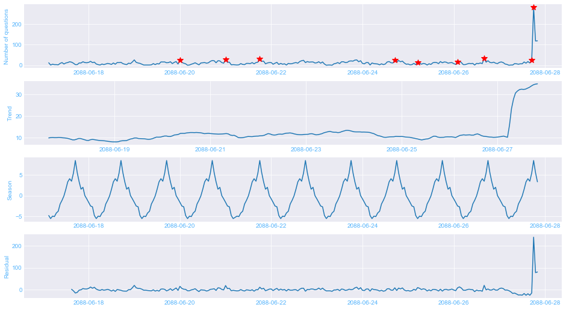
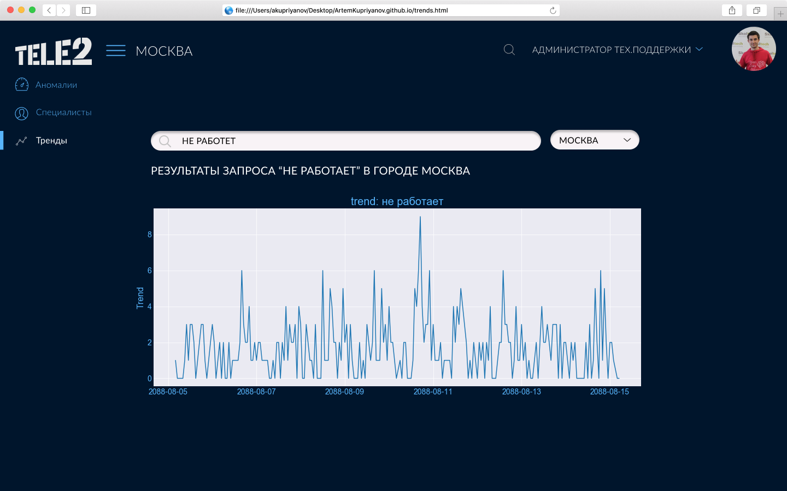

## tele2_hack

### Проект, сделанный командой "Есть 2 теле..." в рамках хакатона tele2.

Краткое описание всего проекта: Система аналитики для работников поддержки. Наша система затрагивает наиболее важные, по нашему мнению, аспекты, в которых до сих пор все делается вручную. 

**Первое**, мы сделали детектор аномалий тем. Поступающие вопросы от пользователей классифицируются по 11 наиболее частым темам: "Проблемы с интернетом", "Вопросы по личному кабинету", "Пополнение баланса" и другим (код: `question_classification.ipynb`). Количество вопросов по данной тематике выводистя в виде графика, на котором можно отследить аномальное количество вопросов, что позволит быстрее реагироавть на проблемы (код: `anomaly_detection.ipynb`). Ранее этот алгоритм выполнялся вручную саппортом.

 

**Второе**, мы позаботились над качеством обслуживания. Мы научились детектировать аномалии в поведении саппорта. Его код по большей части находится в файле `Operator abnormality detection.ipynb`. 
   Алгоритм: unsupervised language model, обученная на всем корпусе ответов операторов. Детекция по нетипично большой перплексии между вероятностями модели и высказыванием оператора. 
  Мотивация: операторы ограничены в выборе слов и словесных конструкций, что модель легко научиться предугадывать следующее слово в высказывании, соответственно на всем, что будет "вне паттерна" модель будет ошибаться.

**Третье**, мы сделали удобный раздел трендов, который позволяет нам понять, как часто некоторое словосочетание встречается в вопросах пользователя. Используя данный трекер трендов, можно понять как часто пользователи испытывали проблемы в прошлом и о чем они пишут в саппорт (код: `text_trends.ipynb`).

### Команда "есть 2 теле...": 

* [Куприянов Артем](http://kupriyanov.me/) (front, UI/UX)

* [Воротынцев Денис](https://www.linkedin.com/in/denis-vorotyntsev/) (детектор аномалий, тренды)

* Абулханов Дмитрий (качество обслуживания)
